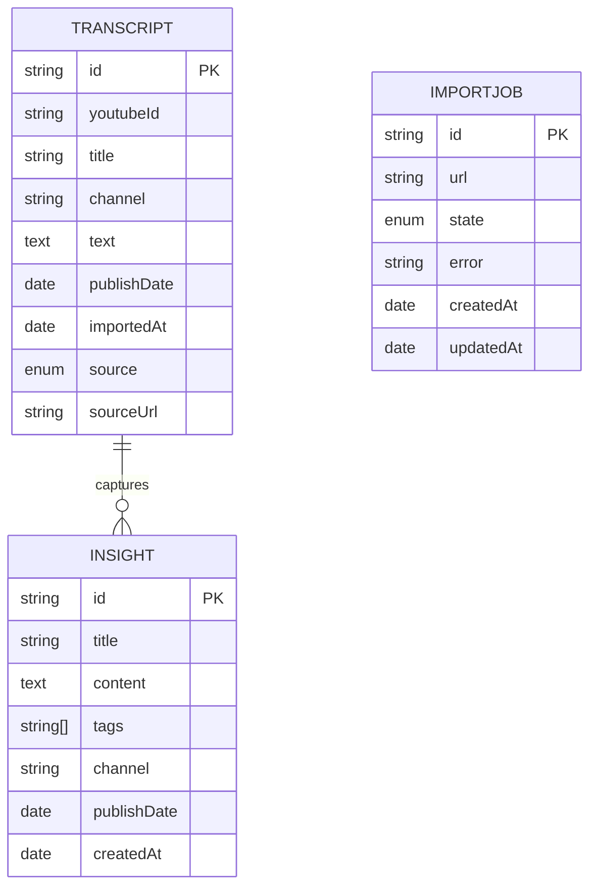
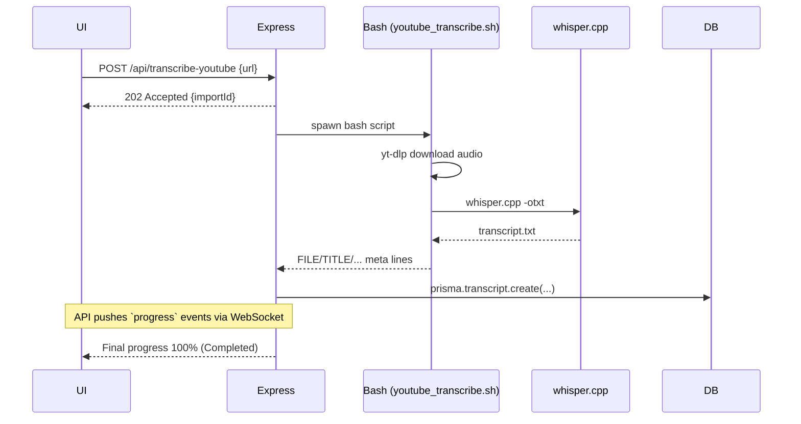
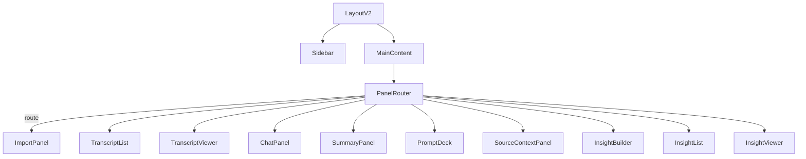

# Insitek Codebase – Deep Technical & Product Overview  
*Last updated: 2025-06-02*

---

## 1 · Executive summary
Insitek ingests spoken-word media (YouTube videos & RSS podcasts), transcribes them locally with Whisper, stores the text in PostgreSQL (via Prisma) and offers AI-powered summarisation, chat and insight-capture in a React (Vite) front-end.

The repository therefore bundles:
1. A React SPA (two UI generations – V1 and V2).
2. An Express + WebSocket backend (`server.mjs`) exposing REST endpoints and progress events.
3. Import/transcription Bash helpers (`youtube_transcribe.sh`, Whisper / yt-dlp integrations).
4. A PostgreSQL schema managed by Prisma migrations.

---

## 2 · Technology stack
| Layer | Technology | Notes |
|-------|------------|-------|
| Front-end | React 18 (Vite) + Tailwind | V1 = imperative layout, V2 = context-driven with router |
| State mgmt | React Context + custom hooks | `NavigationContext`, `ChatContext`, `useTranscript`, … |
| Back-end | Node 20, Express 4, WebSocket (`ws`) | Progress streaming for long-running imports |
| Data | PostgreSQL 15 + Prisma ORM | `schema.prisma` / migrations |
| Speech→text | whisper.cpp | Local transcription – no OpenAI billing |
| Video fetch | yt-dlp | Pulls raw audio + metadata |
| AI agents | `llama.cpp` REST wrapper | Generates chat suggestions |

---

## 3 · High-level architecture
```mermaid
graph TD
  A[Browser (React SPA)] -- REST + WS --> B(Express API)
  B -- Prisma --> C[(PostgreSQL)]
  B -- spawn --> D[Shell scripts<br/>yt-dlp · Whisper]
  D -- transcript.txt --> B
  style A fill:#d5e8ff,stroke:#7aa7f9
  style B fill:#e0ffe0,stroke:#70c470
  style D fill:#fdf2d4,stroke:#e0b955
```

---

## 4 · Data model (Prisma ERD)


---

## 5 · Back-end API surface
| Method | Path | Purpose | File |
|--------|------|---------|------|
| GET | `/api/transcripts` | List all transcripts | `server.mjs` |
| GET | `/api/transcripts/:id` | Fetch single transcript | `server.mjs` |
| DELETE | `/api/transcripts/:id` | Remove transcript | `server.mjs` |
| POST | `/api/transcribe-youtube` | Import single YouTube video | `server.mjs` |
| POST | `/api/channel-last-videos` | List newest *n* uploads | `server.mjs` & `api/channel-last-videos.js` |
| POST | `/api/channel-info` | Channel meta (count, first/last) | `server.mjs` |
| POST | `/api/podcast-feed` | Parse RSS feed | `server.mjs` |
| POST | `/api/transcribe-podcast` | Import podcast episode | `server.mjs` |

WebSocket channel: `ws://<host>:3001/`  
Payload: `{type:"progress", importId, stage, progress}`

---

## 6 · Import pipeline (sequence)


---

## 7 · Front-end structure
```
src/
  assets/          static media
  components/      V1 panels (imperative)
  v2/
    components/    V2 panels + layout
    contexts/      Chat, Navigation
    hooks/         useTranscript · useImport · useAI · ...
    components/ui/ Atomic UI panels (shared)
```

### 7.2 Component tree (V2)


Contexts:  
• `NavigationContext` – UI page/tab, sidebar collapse.  
• `ChatContext` – per-transcript chat state (`messages`, `input`, loading flags).

---

## 8 · Custom hooks
| Hook | Responsibility |
|------|----------------|
| `useTranscript` | CRUD + selection + refresh key |
| `useImport` | Wraps YouTube import & WebSocket progress |
| `useAI` | Generates follow-up prompt suggestions |
| `useInsight` | Captures chat snippets → insights |
| `useInsightExtraction` | AI auto-extraction for selected text |
| `useTransferFunctions` | Bulk transcript → insight transfers |

---

## 9 · CLI / shell helpers
* `youtube_transcribe.sh` – orchestrates yt-dlp + whisper; outputs `STAGE:` / `PROGRESS:` lines parsed by backend.  
* `podcast_transcribe.sh` – mirror for podcast feed items (legacy).  
* Local C++ binaries vendored (`whisper.cpp/`, `llama.cpp/`) – compile on device; no cloud costs.

---

## 10 · Operational notes
1. **Environment**  
   ```bash
   DATABASE_URL=postgres://...
   VITE_API_URL=http://localhost:3001
   ```
2. **Start dev stack**  
   ```bash
   # ① Start DB (docker-compose or local)
   node server.mjs   # backend
   npm run dev       # front-end
   ```
3. **Prisma**  
   `npx prisma migrate dev` updates the DB; generate client is automated.

---

## 11 · Product perspective
### 11.1 Current feature set
• Single & bulk YouTube video import.  
• RSS podcast ingestion.  
• Chat with transcript context, AI-guided prompt suggestions.  
• Smart summary panel.  
• Insight builder + list/viewer with tagging.  
• Source context inspector (quote extraction).

### 11.2 User journeys
1. **Researcher** imports a channel playlist → browses transcripts → drills into Chat → captures insights → exports notes.  
2. **Podcast analyst** pastes RSS feed → transcribes episodes overnight (ImportJob queue) → summarises key moments.  
3. **Content strategist** uses Prompt Deck to brainstorm angles → saves ideas into Insight List.

---

## 12 · Future improvements (mix of PM & Dev POV)
| Area | Quick win | Longer-term |
|------|-----------|-------------|
| UX | Persist V2 navigation state to `localStorage`. | Replace Tailwind utility soup with shadcn-ui primitives or Radix. |
| Scalability | Off-load transcription to a worker pool (BullMQ). | Serverless FaaS for burst STT, use GPU fleet. |
| DB | Full-text search on `Transcript.text` (PG `tsvector`). | Vector store (pgvector) for semantic retrieval. |
| AI | Migrate llama.cpp service to OpenAI function calling for better quality. | Fine-tune domain-specific LLM & RAG over transcript chunks. |
| DevOps | Dockerfile + GitHub Actions PR workflow. | Kubernetes helm chart & horizontal auto-scaling. |
| Testing | Add Vitest + React Testing Library smoke tests. | E2E Cypress covering import → chat → insight flow. |

---

## 13 · Glossary
| Term | Meaning |
|------|---------|
| *Transcript* | Full text produced from media audio. |
| *Insight* | User-curated note (quote, idea) extracted from a transcript or chat. |
| *Prompt Deck* | Library of AI prompts for deeper analysis. |
| *Import Job* | Background task entry tracking bulk operations. |

---

*End of document.* 